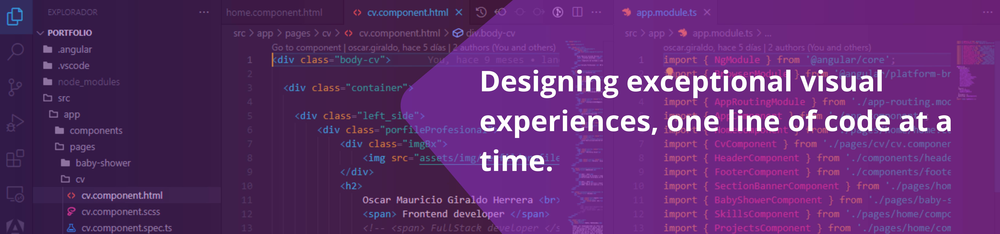

    

## About me

## Professional Profile

Systems and Computer Engineer, with additional training in Java and JavaScript programming, English (A1 level). 5 years and 5 months of work experience in web development.

Skills and knowledge in handling frontend development frameworks and libraries (Vue, Angular, React). Specialized in designing and developing user interfaces with pure HTML and CSS, as well as CSS libraries (Tailwind, Quasar, PrimeNG, and Bootstrap). Experience in consuming APIs and mocking data, and working with Agile Scrum methodologies using Jira and Azure DevOps.

Strong analytical skills, creative, competitive, with self-control, planning, and organizational abilities. I enjoy taking on new challenges and adapt easily. Passionate about problem-solving and best development practices, I strive to follow the standards of each framework I work with.

## <b> Skills</b>

<!--tech stack icons-->

- **Languages**:

  

- **Front-End Development**:

    

- **Softwares and Tools**:

<!--  -->

<!--
**oscarmauriciogiraldo/oscarmauriciogiraldo** is a ✨ _special_ ✨ repository because its `README.md` (this file) appears on your GitHub profile.

Here are some ideas to get you started:

- 🔭 I’m currently working on ...
- 🌱 I’m currently learning ...
- 👯 I’m looking to collaborate on ...
- 🤔 I’m looking for help with ...
- 💬 Ask me about ...
- 📫 How to reach me: ...
- 😄 Pronouns: ...
- ⚡ Fun fact: ...
-->
